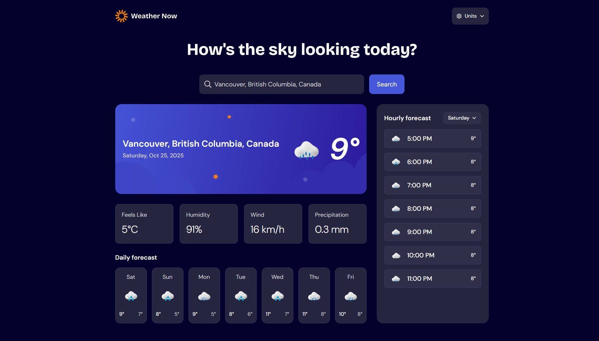

# Frontend Mentor - Weather app solution

This is a solution to the [Weather app challenge on Frontend Mentor](https://www.frontendmentor.io/challenges/weather-app-K1FhddVm49). Frontend Mentor challenges help you improve your coding skills by building realistic projects. 

## Table of contents

- [Frontend Mentor - Weather app solution](#frontend-mentor---weather-app-solution)
  - [Table of contents](#table-of-contents)
  - [Overview](#overview)
    - [The challenge](#the-challenge)
    - [Screenshot](#screenshot)
    - [Links](#links)
  - [My process](#my-process)
    - [Built with](#built-with)
    - [What I learned](#what-i-learned)
  - [Author](#author)

## Overview

### The challenge

Users should be able to:

- Search for weather information by entering a location in the search bar
- View current weather conditions including temperature, weather icon, and location details
- See additional weather metrics like "feels like" temperature, humidity percentage, wind speed, and precipitation amounts
- Browse a 7-day weather forecast with daily high/low temperatures and weather icons
- View an hourly forecast showing temperature changes throughout the day
- Switch between different days of the week using the day selector in the hourly forecast section
- Toggle between Imperial and Metric measurement units via the units dropdown 
- Switch between specific temperature units (Celsius and Fahrenheit) and measurement units for wind speed (km/h and mph) and precipitation (millimeters) via the units dropdown
- View the optimal layout for the interface depending on their device's screen size
- See hover and focus states for all interactive elements on the page

### Screenshot



### Links

- Solution URL: [Add solution URL here](https://your-solution-url.com)
- Live Site URL: [Add live site URL here](https://your-live-site-url.com)

## My process

### Built with

- Flexbox
- CSS Grid
- [Angular](https://angular.dev) - JS library
- [Angular Material](https://material.angular.dev/) - UI components

### What I learned

This project was my first deep dive into Angular’s new Signals and resource APIs. Signals provided a simple, reactive way to manage state, while the resource and rxResource APIs made it easy to handle async data loading with built-in loading and error states.

**Example: Using `resource` for weather data**

```typescript
readonly weatherResource = resource({
  params: () => this.selectedLocation(),
  loader: async ({ params }) => {
    if (!params) return null;
    const urlParams = new URLSearchParams({
      latitude: params.lat.toString(),
      longitude: params.lon.toString(),
      // ...other params...
      timezone: 'auto',
      forecast_days: '7'
    });
    const url = `${this.BASE_URL}?${urlParams.toString()}`;
    const response = await fetch(url);
    if (!response.ok) throw new Error(`HTTP error! status: ${response.status}`);
    const data = await response.json();
    return this.transformResponse(data);
  }
});
```

**Example: Using `rxResource` for city search**

```typescript
readonly searchResults = rxResource({
  params: computed(() => ({ query: this.debouncedSearchQuery() })),
  stream: ({ params }) => this.searchCities(params.query),
  defaultValue: [] as CityResult[]
});
```

With these APIs, I could declaratively manage async data and UI state, making the app more robust and maintainable. I highly recommend exploring Signals and the resource API for modern Angular projects!

## Author

- Frontend Mentor - [@webguy83](https://www.frontendmentor.io/profile/webguy83)
- Instagram - [@canadianwebdev83](https://www.instagram.com/canadianwebdev83/)
